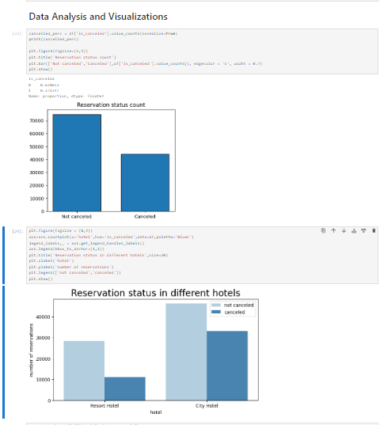

# hotel_booking_analysis
The analysis of hotel booking cancellations

Business Problem
=====================
In recent years, city hotel and resort hotel have seen high cancellation rates. Each hotel is now dealing with number of issues as a result, including fewer revenues and less than ideal hotel
room use. Consequently, lowering cancellation rates is both hotels primary goal in order to increase their efficiency in generating revenue, and for us to offer through business advice to address this problem.

The analysis of hotel booking cancellations as well as other factors that have no bearing on their businesses and yearly revenue generation are the main topics of this report.

This bargraph shows percentage of reservations that are cancelled and those that are not.

37% of clients canceled their reservation,which has  a significant impact on the hotels earnings

city hotels have more bookings when compare to resort hotels

on certain days, the average daily rate for a city hotel is less than taht of resort hotel

weekends and holidays may see rise in resort hotels rate

developed grouped bar graph to analyze months with the highest and lowest reservation levels aCCording to reservation status

portugal has the highest cancellations

